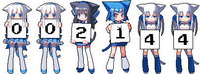

# Moe-Counter-Busuanzi

Make your site moe moe 🪄!

A static version of [Moe-Counter](https://github.com/journey-ad/Moe-counter), so you don't have to deploy it on a server.

[Busuanzi](https://busuanzi.ibruce.info/) is used to count page views.

## Demo



Visit [here](https://liuly.moe) to see the live demo.

## Installation

```shell
npm install moe-counter-busuanzi
```

You can also self-host `dist` folder, or use a CDN.

## Usage

- `fetchBusuanziCounter`: get the page view count
- `generateCounterImage`: generate the counter image SVG string, then you can put in some HTML element

```HTML
<!-- We are writing es module code, so wrap it in a <script type="module"></script> tag. -->
<script type="module">
import { generateCounterImage, fetchBusuanziCounter } from "moe-counter-busuanzi";
// If you want to import it from CDN:
// import { generateCounterImage, fetchBusuanziCounter } from 'https://cdn.jsdelivr.net/npm/moe-counter-busuanzi/+esm'
// Warning: if you want to use a CDN, please fix a version, or there may be breaking changes.

const busuanziResult = await fetchBusuanziCounter();
const counterSVGString = generateCounterImage(
  busuanziResult.page_pv,   // site_uv, page_pv, site_pv
  6,                        // The length of the counter
  true                      // use default theme
);
document.getElementById("counter")!.innerHTML = counterSVGString;

// You can also import or customize themes
// Check all themes in `themes` folder
// import { moebooruEcchiImages } from 'moe-counter-busuanzi/dist/themes/mbh.js'
// const counterSVGString = generateCounterImage(
//   busuanziResult.page_pv,
//   6,
//   false,                 // don't use default theme
//   moebooruEcchiImages    // custom theme
// );
</script>
```

TypeScript is supported.

```typescript
type BusuanziResult = {
  site_uv: number;
  page_pv: number;
  site_pv: number;
};
```

## Credits

- [Moe-counter](https://github.com/journey-ad/Moe-counter)
- [moebooru](https://github.com/moebooru/moebooru)
- rule34.xxx NSFW
- gelbooru.com NSFW
- [Icons8](https://icons8.com/icons/set/star)
- [Busuanzi](https://busuanzi.ibruce.info/)
- [CMoe-Counter](https://github.com/fumiama/CMoe-Counter)
